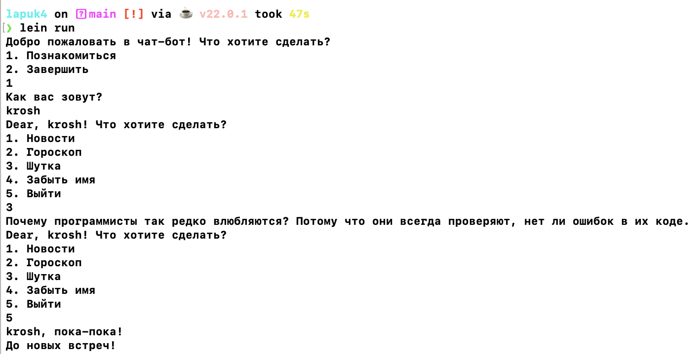

# Лабораторная работа №4

## Титульный лист

**Студент**: Зайцева Ирина Сергеевна

**Группа**: P3309

**ИСУ**: 367222


### Описание алгоритмов

В процессе разработки был реализован набор функций и макросов для обработки диалогов, управления состоянием пользователя и переходами между различными частями диалога. 

1. Весь процесс общения с ботом строится вокруг состояния пользователя, которое хранится в глобальном атоме `bot-state`. Статус пользователя (например, имя, текущий диалог) сохраняется и обновляется с помощью функций `set-user-state` и `get-user-state`.
2. Макрос `defdialogue` позволяет определять диалоги с переходами. Переходы между состояниями описаны с помощью `Transition`, которые содержат текст, ID следующего состояния и, если необходимо, действие.

## Ключевые элементы реализации

### Основные функции

1. `set-user-state`: Функция обновления состояния пользователя. Используется для изменения текущего диалога, имени и других параметров.
```clojure
(defn set-user-state [user-id key value]
  (swap! bot-state assoc-in [user-id key] value))

```
2. `get-user-state`: Функция получения состояния пользователя. В зависимости от состояния возвращает описание текущего диалога.
```clojure
(defn get-user-state [user-id]
  (get @bot-state user-id {:name nil :current-dialogue :main-menu}))

```
3. `add-dialogue`: Функция добавления нового диалога с определением переходов.
```clojure
(defn add-dialogue [name description transitions & [input-required]]
  (swap! dialogues assoc name (->Dialogue name description transitions input-required)))

```
4. `process-user-input`: Главная функция для обработки ввода пользователя. На основе текущего состояния и введенных данных решает, какой переход должен быть выполнен и что вывести пользователю.
```clojure
(defn process-user-input [user-id input]
  (let [user-state (get-user-state user-id)
        current-dialogue (get-dialogue (:current-dialogue user-state))
        transitions (:transitions current-dialogue)
        input-required (:input-required current-dialogue)]
    (cond
      input-required
      (let [transition (first transitions)]
        (process-transition user-id transition input)
        (get-dialogue-for-user user-id))

      (empty? transitions)
      {:error "Нет доступных действий"}

      :else
      (if-let [matching-transition (find-transition transitions input)]
        (do
          (process-transition user-id matching-transition input)
          (get-dialogue-for-user user-id))
        (if (nil? (:current-dialogue user-state))
          "До новых встреч!"
          {:error "Неверный ввод"})))))
```
5. `defdialogue`: Макрос, позволяющий определить новый диалог с переходами и действиями. Включает описание, переходы и возможность ввода.
```clojure
(defmacro defdialogue [name description & transitions]
  (letfn [(is-input-required [item]
            (and (map? item) (contains? item :input-required)))
          (process-transition [t]
            (let [{:keys [text next-id action]} t]
              `(->Transition ~text ~next-id ~action)))
          (split-transitions [transitions]
            (let [last-item (last transitions)]
              (if (is-input-required last-item)
                [(butlast transitions) (:input-required last-item)]
                [transitions false])))]
    (let [[transitions input-required] (split-transitions transitions)
          processed-transitions (map process-transition transitions)]
      `(add-dialogue ~name
                     ~description
                     ~(vec processed-transitions)
                     ~input-required))))
```

## Пример работы



## Вывод
Во время разработки лабораторной работы я изучила основы создания embedded DSL. Применяя макросы и функции, я создала систему для управления диалогами с пользователями, обработки ввода и предоставления контента. С помощью данного подхода можно легко адаптировать бота под различные сценарии общения с пользователем.